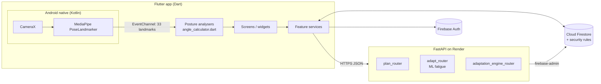
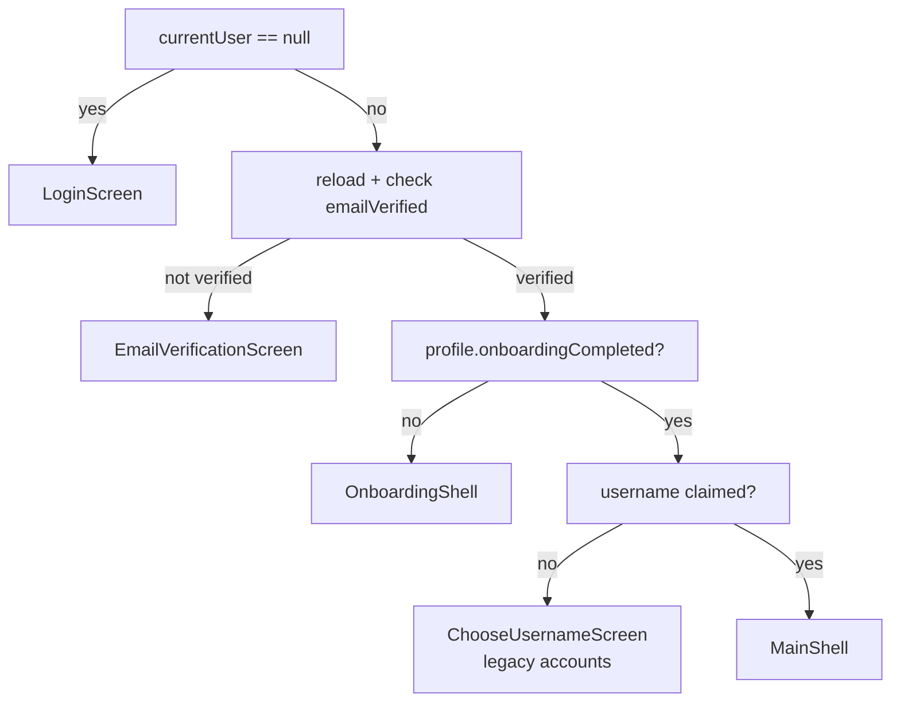
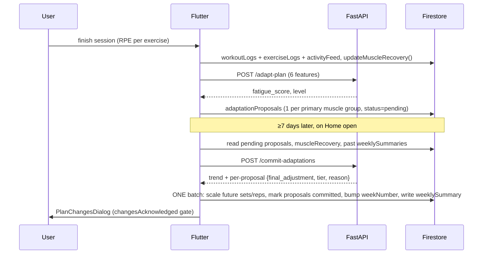

# Rakan — System Overview (Report Source Document)

> **Purpose:** a single, code-verified reference describing the whole Rakan system — design, frontend, backend, ML, data model, algorithms, security and testing — so it can be handed to an AI assistant (or a human) as source material for writing the FYP report/dissertation.
>
> **How this was produced:** generated from a read-through of the repository at commit `367f06d` (branch `main`, 114 commits, first commit 2026-04-09). Where a fact comes from `HANDOVER.md` (Phase 27, not re-verified against code) rather than the code itself, it is tagged **[HANDOVER]**. Items I found by reading code that contradict or extend the handover are in §17 (*Known issues & report caveats*) — **read that section before making any claims in the report.**

---

## 1. Project summary

| Item | Value |
|---|---|
| Name | **Rakan** — *Adaptive AI Fitness Coach with Real-Time Posture Correction* |
| Type | Final Year Project (university, supervisor-reviewed); solo developer |
| Target users | Gym/home exercisers, Malaysian market |
| Platform | Flutter mobile app (Android primary; iOS/desktop scaffolds exist but pose detection is Android-only) |
| Backend | FastAPI (Python 3.12) on Render free tier (~50 s cold start) |
| Data / Auth | Firebase Firestore + Firebase Auth (email/password + Google) |
| ML | scikit-learn `LinearRegression` fatigue predictor (+ `StandardScaler`) |
| Pose detection | MediaPipe Tasks Vision `pose_landmarker.task`, native Kotlin, CameraX, Flutter platform channels |
| Cost constraint | "Keep cost close to zero" — no paid services, local notifications instead of FCM, no Cloud Functions, no Firebase Storage (profile photos are base64 in Firestore) |
| Test device | Samsung S20 FE |

### Three project objectives (from `HANDOVER.md`)
1. **Adaptive planner** — mobile app with AI-based adaptive workout planner + performance dashboard that generates and auto-updates personalised 7-day routines from equipment, performance and recovery data; target ≥75 % user satisfaction via UAT.
2. **Real-time posture detection** — MediaPipe form analysis with instant feedback; target **≥75 % accuracy** on key exercises (the original proposal said 90 %; **75 % supersedes it**).
3. **Fatigue & recovery monitoring** — adjust intensity from user-reported RPE, evaluate effect on overtraining risk.

Status **[HANDOVER, Phase 27]**: adaptive pipeline on-device verified (missed-day flow, all 7 signals); plateau detection unit-tested but not device-verified; posture accuracy study **not yet conducted** (instrumentation exists); UAT not yet done; fatigue-effectiveness evaluation not yet done.

---

## 2. High-level architecture



**Key architectural properties**
- **Two-writer Firestore.** The Flutter client writes most data directly (subject to security rules). The backend writes using the **Admin SDK** (bypasses rules) for plan generation/regeneration only.
- **Backend is mostly a stateless rules/ML API.** `/adapt-plan` and `/commit-adaptations` take numbers in, return numbers out — no Firestore access. Only `/generate-plan` and `/regenerate-plan` touch Firestore.
- **Orchestration lives in the client.** The Flutter `WeeklySummaryService` gathers data, calls the backend, then applies the returned adjustment to Firestore in one batch.
- **Pose detection is 100 % on-device** (no video ever leaves the phone).
- **Reminders are local notifications** (`flutter_local_notifications`), not push.

---

## 3. Technology stack & dependencies

**Frontend** (`pubspec.yaml`, SDK `^3.11.4`, Flutter 3.41.6 **[HANDOVER]**): `firebase_core`, `firebase_auth`, `cloud_firestore`, `google_sign_in`, `google_fonts`, `fl_chart` (charts), `flutter_body_heatmap` (muscle map), `share_plus`, `http`, `uuid`, `image_picker`, `image_cropper`, `flutter_image_compress`, `webview_flutter` (YouTube embeds), `flutter_local_notifications`, `timezone`, `flutter_timezone`, `shared_preferences`, `package_info_plus`. Run: `flutter run --no-dds`.

**Backend** (`backend/requirements.txt`): FastAPI, uvicorn, pydantic, firebase-admin, python-dotenv, scikit-learn, joblib, numpy, pandas. Deploy: `render.yaml` → `rootDir: backend`, `uvicorn main:app --host 0.0.0.0 --port $PORT`; credentials via `FIREBASE_CREDENTIALS_JSON` env var on Render, `serviceAccountKey.json` locally. Backend URL `https://rakan-backend.onrender.com` (hard-coded in five Dart files).

**Native Android**: Kotlin (`MainActivity.kt`, `PoseDetectorHandler.kt`, `CameraPreviewFactory.kt`), CameraX, MediaPipe Tasks Vision 0.10.14 **[HANDOVER]**, model asset `android/app/src/main/assets/pose_landmarker.task`.

---

## 4. Repository layout

```
rakan/
├─ HANDOVER.md              # running dev log: phases, 60 numbered design decisions, backlog
├─ firestore.rules          # Firestore security rules
├─ firebase.json
├─ pubspec.yaml
├─ assets/
│   ├─ exercise_gifs/       # ~125 local GIF demos
│   ├─ exercise_thumbnails/  muscle_illustration/  fonts/  images/
├─ android/app/src/main/kotlin/com/example/rakan/   # native pose pipeline
├─ backend/
│   ├─ main.py              # FastAPI app; mounts 3 routers; / and /test-firebase
│   ├─ firebase_config.py   # Admin SDK init (env JSON or local file)
│   ├─ routers/             # plan_router, adapt_router, adaptation_engine_router
│   ├─ services/            # plan_generator.py, adaptation_engine.py
│   ├─ data/exercises.py    # backend exercise pool (126 exercises)
│   ├─ ml/                  # generate_training_data.py, train_model.py, *.pkl, training_data.csv
│   └─ tests/test_adaptation_engine.py
├─ lib/
│   ├─ main.dart, app.dart, firebase_options.dart
│   ├─ core/{constants,theme,utils}/     # AppColors, AppTypography, AppTheme, Validators
│   ├─ shared/widgets/                   # MainShell (4-tab), bottom nav, UserAvatar
│   └─ features/
│       ├─ auth/        (login, register, email verification, throttle, nav routing)
│       ├─ onboarding/  (splash, 8-step wizard, plan generation, summary, models)
│       ├─ home/        (dashboard, calendar, missed-day dialog, plan-changes dialog)
│       ├─ workout/     (schedule, library, active session, auto-log, pose, services, data)
│       ├─ coach/       (stats, recovery map, records, injuries, weight)
│       ├─ social/      (username, search, follow, profiles, likes/comments)
│       └─ settings/    (profile/stat/equipment editing, reminders, privacy, password)
└─ test/                # Dart tests (adapt_service, angle_calculator, schedule_matcher, widgets)
```

Approx. size: ~33 k lines of Dart/Python (largest files: `coach_screen.dart` 3.8 k, `exercise_data.dart` 2.3 k data, `workout_screen.dart` 1.8 k, `workout_active_screen.dart` 1.3 k, `plan_generator.py` 371).

---

## 5. UI / design system — "Kinetic Precision"

Dark, premium, "tonal depth" aesthetic. Defined in `lib/core/theme/` (`app_colors.dart`, `app_typography.dart`, `app_theme.dart`).

| Token | Hex | Use |
|---|---|---|
| `background` / `surface` | `#0C0E10` | app background |
| `surfaceContainerLowest` | `#000000` | photo backgrounds |
| `surfaceContainerLow` | `#13161A` | cards, sections |
| `surfaceContainerHigh` | `#1C2026` | active cards, modals |
| `surfaceBright` | `#252A30` | inactive chips |
| `primary` | `#C6C6C7` | metallic-silver accent |
| `primaryContainer` | `#9B9EA3` | secondary accent |
| `onPrimary` | `#0C0E10` | text on accent |
| `onSurface` | `#E8E8E9` | primary text |
| `onSurfaceVariant` | `#9B9EA3` | muted text |
| `outlineVariant` | `#2A2D32` | ghost dividers |
| `error` | `#EE7D77` | errors/destructive |

- **Typography:** *Space Grotesk* (display/headlines: 56/28/22 px) + *Manrope* (body 16/14, labels 11).
- **Rules:** no hard borders — separate surfaces by tone only; use `withValues(alpha:)` not deprecated `withOpacity()` (`coach_screen.dart` still has ~17 legacy `withOpacity` calls **[HANDOVER]**).
- **Navigation:** `MainShell` = `IndexedStack` of four tabs (state preserved) with a custom bottom nav: **Home · Workout · Coach · Settings**.
- **Design vocabulary in UI copy:** upper-case letter-spaced section labels ("ACTIVITY LOG", "CURRENT CYCLE", "EFFORT LEVEL (RPE)"), segmented pill switchers, bottom sheets for choices, dialogs for interrupts.

---

## 6. App flow & screens

### 6.1 Startup and routing
`main.dart` → `Firebase.initializeApp` → `RakanApp` (dark `MaterialApp`) → `SplashScreen` → `AuthNavigationService.resolveNextScreen()`:



### 6.2 Auth screens
`login_screen`, `register_screen` (live password-strength checklist), `email_verification_screen` (poll/reload + resend), plus `change_password_dialog` in Settings.

### 6.3 Onboarding (8 steps + generation)
State travels in one mutable `OnboardingData` object with per-step validity getters.

| Step | Captures |
|---|---|
| 1 Profile | name, unique `@username` (claimed in a transaction), gender, age, height, weight (metric/imperial toggle), activity level (5 levels) |
| 2 Goal | `muscleGain / weightLoss / endurance / flexibility` |
| 3 Experience | `beginner / intermediate / advanced` |
| 4 Preference | workout days (1–7 weekdays), session duration (30/45/60/90+ min) |
| 5 Environment | equipment set (`fullGym, barbell, dumbbell, kettlebell, resistanceBand, pullUpBar, bench, machines, noEquipment`) |
| 6 Motivation | 6 options (look better, strength, health, energy, stress, athletic performance) |
| 7 Focus areas | chest/back/arms/shoulders/abs/legs/glutes/fullBody |
| 8 Safety | injuries via interactive **body-map painter** (16 `BodyRegion`s + custom label) |

Then: `PlanGenerationScreen` (POST `/generate-plan`, **90 s timeout** for Render cold start) → `WorkoutSummaryScreen` → `MainShell`. Profile is saved to `users/{uid}/profile/data` via `OnboardingData.toMap()` (`onboardingCompleted: true`). Height/weight stored metric-first (`heightCm`, `weightKg`) with an `isMetric` display flag.

### 6.4 Home tab
Header, week indicator (shows mesocycle week; every 4th week flagged deload), **hero card** (no-plan / rest-day / workout-day variants), weekly calendar (uses `ScheduleMatcher`), "daily evolution" chip, **ACTIVITY LOG** feed of recent sessions. On open it (a) triggers `WeeklySummaryService.checkAndGenerateWeeklySummary`, (b) runs missed-day detection and shows `MissedDayDialog`, (c) shows `PlanChangesDialog` for an unacknowledged weekly summary.

### 6.5 Workout tab
Segmented **SCHEDULE / EXERCISE LIBRARY**.
- *Schedule:* "CURRENT CYCLE", workout/rest counts, per-day cards; edit mode supports **Replace Day** (swap content between days), **Cancel Day** (→ rest), **Convert rest→workout** (empty or template), add/remove/reorder exercises, per-day **start-time reminder**.
- *Library:* 127 static `ExerciseData` entries (muscle group, secondary muscles, difficulty, equipment, YouTube id, steps, tips, GIF/thumbnail, `hasPoseDetection`), filter by muscle group, detail sheet.
- *Session flow:* `WorkoutPreviewScreen` → choose **Manual** (`WorkoutActiveScreen`: scrollable list, per-set reps/weight, per-exercise **RPE 1–10 slider**) or **Guided** (`AutoLogScreen`: phase machine `ready → active → resting → rpe`, rest timers, optional camera rep-counting) → `WorkoutCompleteScreen` (summary, PRs, photo, triggers adaptation) → `WorkoutLogDetailScreen` for history.
- Standalone `PoseDetectionScreen` (countdown overlay → live skeleton + feedback + rep counter).

### 6.6 Coach tab (segmented: **Stats Report · Recovery Map · Records**)
- *Stats:* workouts/volume/duration KPIs, trend charts (WEEK / MONTH / 3 MONTHS via `fl_chart`), muscle-focus distribution, weight progress, per-exercise progression chart **with passive plateau notice**, weekly plan-change history (`PlanChangesSection`).
- *Recovery Map:* body heat-map coloured by per-muscle `fatigueScore` (front/back toggle), injuries list with progress bars ("RECOVERING"/"RECOVERED"), full-screen **Log Injury** flow (tap body region, pick expected recovery days).
- *Records:* PRs (`WorkoutPrRecord`), all-records screen, body-weight log (`WeightRecord`, add/edit/delete).
- **Protocol Reset** button → `PlanResetFlow` (also reachable from Settings → "Update Fitness Goals").

### 6.7 Settings tab
Profile header with avatar (image_picker → crop → compress → base64), social counters (followers/following/sessions), Change Password, Personal Stats, Edit Equipment, Update Fitness Goals (plan reset), workout reminders (toggle + time), **Private Account** switch, About (dynamic version via `package_info_plus`), Log Out.

### 6.8 Social screens
`FindUsersScreen` (prefix search), `UserProfileScreen` (follow button with none/pending/accepted/self states, recent activity), `FollowersFollowingScreen` (incl. pending-requests section), `ActivityLogCard` + `ActivityActionsRow` (likes, comments, share via `share_plus`), `ChooseUsernameScreen`.

---

## 7. Backend design (FastAPI)

### 7.1 Endpoints
| Method & path | Purpose | Touches Firestore? |
|---|---|---|
| `GET /` | health | no |
| `GET /test-firebase` | writes `_test/ping` (connectivity check) | yes |
| `POST /generate-plan` | rule-based 7-day plan → saved as `workoutPlans/{planId}` (+`days`, +`exercises`) | **write** |
| `POST /regenerate-plan` | re-select exercises for unlogged workout days around active injuries | read+write |
| `POST /adapt-plan` | ML fatigue prediction → level + raw adjustment | no |
| `POST /commit-adaptations` | trend + tiered resolution of pending proposals | no |

### 7.2 `/generate-plan` — rule-based plan generator (`plan_generator.py`)
Input: `uid, goal, experience, equipment[], workout_days[1–7], session_duration, focus_areas[]`.

1. **Pool** = `get_exercises_for_equipment(equipment)` then `filter_by_difficulty(experience)`.
2. **Exercises per session:** beginner 4 / intermediate 5 / advanced 6; `thirtyMin` → −1 (min 3); `ninetyPlusMin` → +1.
3. **Split template by number of days:** 1 Full Body · 2 Upper/Lower · 3 Push/Pull/Legs · 4 PPL+Full · 5 Chest&Tri/Back&Bi/Legs/Shoulders&Arms/Full · 6 body-part split+Full · 7 same + Active Recovery. Each split name → muscle-group list (`SPLIT_MUSCLES`).
4. **Selection tiers (`_select_raw_exercises`)**, each shuffled for variety: (1) compound exercises for the day's muscles; (2) user's focus-area exercises; (3) isolation exercises to fill remaining slots.
5. **Duration estimate** = Σ (sets × rest + sets × 45 s) / 60.
6. Selected weekdays become workout days in order; other weekdays are rest days. Output is a plan with 7 `days`.
7. Persisted as `plan → days → exercises` documents; `exerciseId` and `dayPlanId` are UUIDs.

**Goal has effectively no influence on `/generate-plan`.** `GOAL_MUSCLE_PRIORITY` is looked up and passed into `_select_raw_exercises`, but that function never reads `muscle_priority`; it is only used in `regenerate_days` (fallback muscle choice when an injury removes a day's whole focus). Sets/reps/rest also don't vary by goal. Selection depends on equipment, experience, split, focus areas and session duration. *(Report tip: don't claim goal-specific programming; describe it as future work.)*

### 7.3 `/regenerate-plan` — injury-aware regeneration
1. Determine days already **logged this week** (`get_logged_day_numbers_this_week` — Mon–Sun by UTC) → **locked**, never touched.
2. For each remaining workout day, remove injured muscle groups from that day's targets; if the entire focus is excluded, **fallback** to the goal's top-2 non-excluded groups and label the day "(Adjusted)"; if everything is excluded → rest day ("Recovery (injury-adjusted)").
3. Re-select exercises; **batch-write** overwrite of day metadata + delete old exercises + write new.
4. Client side (`InjuryService`): body regions map to muscle groups (`kBodyRegionToMuscleGroups`; head/neck deliberately excluded); injuries with status `recovered` are ignored; call is best-effort (errors swallowed, 90 s timeout).

### 7.4 Exercise pool (`backend/data/exercises.py`)
126 entries. By muscle group: legs 22, back 19, abs 19, chest 18, arms 17, shoulders 16, glutes 15. By difficulty: beginner 84, intermediate 34, advanced 8. Fields: `name, muscle_group, secondary_muscles, equipment[], difficulty, sets, reps, rest_seconds, is_compound, wger_id`. (The Flutter app carries its **own** 127-entry static library — the two lists are not a single source of truth; see §17.)

### 7.5 Startup
`main.py` mounts the three routers. `adapt_router` loads `fatigue_model.pkl` + `fatigue_scaler.pkl` **once at import**; if missing it falls back to `avg_rpe/10`.

---

## 8. Machine-learning component

### 8.1 Model
- **Algorithm:** `LinearRegression` on `StandardScaler`-scaled features; 80/20 split, `random_state=42`.
- **Features (6):** `avg_rpe, max_rpe, session_duration (min), exercises_count, completion_rate (0–1), experience_level (0/1/2)`.
- **Target:** `fatigue_score` ∈ [0,1]; prediction is **clamped** to [0,1].
- **Fallback:** if model files are absent → `fatigue_score = avg_rpe / 10` (justified via RPE-based regulation, Zourdos et al. 2016).

### 8.2 Training data — **synthetic**
`generate_training_data.py` (seed 42, N = 1000): experience ~ {0: 40 %, 1: 40 %, 2: 20 %}; base RPE by experience {5.0, 6.5, 7.5} + N(0,1.5); `max_rpe = avg + U(0,2)`; duration ~ N(50,15) clipped 20–120; exercises 3–7; completion falls as RPE rises. Label:

```
fatigue = 0.35·(avg_rpe/10) + 0.25·(max_rpe/10) + 0.15·(duration/120)
        + 0.15·(1 − completion) + 0.10·exp_penalty   (+ N(0, 0.05), clipped 0–1)
exp_penalty = {beginner 0.30, intermediate 0.15, advanced 0.0}
```
Label distribution in `training_data.csv`: 253 low (<0.4), 713 medium (0.4–0.7), 34 high (≥0.7).

### 8.3 Measured performance (re-computed from the committed CSV, same split/seed)
| Metric | Value |
|---|---|
| MAE | **0.0404** |
| R² | **0.829** |

Standardised coefficients: avg_rpe +0.055, max_rpe +0.052, session_duration +0.018, exercises_count −0.0003, completion_rate −0.014, experience_level **−0.011**.

> ⚠️ **Report caveat:** because labels come from a hand-written linear formula, a linear model recovering it is expected and **R² does not validate real-world accuracy**. Present it as "the model reproduces the fatigue heuristic" and acknowledge the absence of real user labels. Note also `experience_level` gets a *negative* coefficient (the generator's `exp_penalty` opposes the fact that more experienced users have higher base RPE, so the collinearity flips the sign) — an examiner may ask.

### 8.4 Fatigue → adjustment thresholds (`_apply_adaptation_rules`, single source of truth)
| fatigue_score | level | intensity adjustment | source cited in code |
|---|---|---|---|
| > 0.7 | high | **−17.5 %** | Bell et al. (2025), reactive deload |
| 0.4 – 0.7 | medium | **0 %** | ACSM (2026): RPE 6–7 / completion 70–90 % → maintain |
| < 0.4 | low | **+10 %** | ACSM (2026), NASM: 5–10 % progressive overload |

---

## 9. Adaptive system (the core contribution)

### 9.1 End-to-end pipeline



Design principle: **the session only *proposes*; adjustments are committed weekly**, so the plan doesn't lurch after every workout.

### 9.2 Signals
`HANDOVER.md` refers to "Signals #1–7" but its full signal table lives in an earlier version that is not in the repo, so the numbering below is **not** taken from it. The mechanisms actually present in code are: (a) session fatigue (ML/RPE), (b) per-muscle recovery load, (c) weekly volume trend, (d) scheduled mesocycle deload, (e) return-from-break after an explicit skip, (f) forced deload from high recovery load, and (g) the weekly cadence/proposal mechanics. Per the handover, Signal #7 is the return-from-break signal, whose timing relies on the client clock (Decision #56). **Confirm the exact numbering with the author before using "Signal N" labels in the report.**
**Plateau detection is deliberately *not* a signal** (Decision #57).

### 9.3 Muscle recovery model (`WorkoutLogService.updateMuscleRecovery`, run after every save)
- Window: last 7 days of `workoutLogs`; for each completed set, **primary muscle gets 1.0 set credit**, each distinct broad **secondary group 0.5** (`kSecondaryMuscleWeight`). Granular tags ("Lats", "Quads", …) are collapsed to 7 broad groups via `kGranularToBroadMuscleGroup`.
- `fatigueScore = clamp(weightedSets / MRV, 0, 1)`.
- **Weekly MRV (sets/wk):** Back/Chest/Legs/Glutes 20; Shoulders/Arms 16; Core 12; fallback 16.
- `recommendedRestDays` = 2 if score < 0.5 else 3.
- Persisted per group at `muscleRecovery/{group}` with `lastTrained`, `volumeLast7Days`, `weightedSetsLast7Days`, `weeklyMrv`, `updatedAt`. Bodyweight sets add reps only (not reps×0) to volume.

### 9.4 Weekly trend (`compute_trend`)
`pct = (current − mean(past)) / mean(past)`:
> +5 % → *increasing* (+0.05); < −10 % → *decreasing* (−0.10); otherwise *stable* (0). No history or zero baseline → *insufficient_data*.

### 9.5 Tiered resolution (`resolve_adjustment`) — priority order
| Tier | Condition | Result |
|---|---|---|
| **0 scheduled_deload** | `is_deload_week` (week # % 4 == 0) | **−42.5 %**, overrides everything |
| **0.5 return_from_break** | `trigger == "skip"` | gap ≤ 28 d → **0 %** (short-term detraining, adaptations retained); gap > 28 d or unknown → **−17.5 %** |
| **1 forced_deload** | muscle recovery > **0.8** | `min(session_adj, −17.5 %)` |
| **2 weekly_priority** | recovery < **0.5** | `max(session_adj, weekly_trend_adj)` (well recovered → trend can drive progress) |
| **3 session_priority** | 0.5–0.8 | session fatigue adjustment (acute, safety-relevant signal wins) |

Every result carries a human-readable `reason` string with citations — surfaced to the user in the plan-changes dialog.

### 9.6 Applying adjustments (client)
`_applyAdjustmentToMuscleGroup`: for **future** days only (`dayNumber > today.weekday`, non-rest), each exercise whose primary group matches gets
`sets = clamp(round(sets·(1+adj)), 1..6)`, `reps = clamp(round(reps·(1+adj)), 3..20)`; stamped with `adaptedAt`, `fatigueLevel` (=tier), `adaptationSource: "engine_v2"`. Only *changed* exercises count toward the summary. **Weight is never modified** (basis for plateau detection).

### 9.7 Missed-day flow (Phase 25/26)
- **Detection** (`computeMissedDays`, pure): scan back ≤30 days from yesterday; a scheduled workout day with no log and no resolution doc is *missed*, per **muscle group + date** (key `"{group}|YYYY-MM-DD"`). Bounded by the plan's `generatedAt` so brand-new plans don't retroactively "miss" days (Phase 26 bug fix).
- **User choice** (`MissedDayDialog`, grouped by date visually, resolved per muscle group): **Reschedule** or **Skip entirely**.
- **Reschedule:** `computeValidRescheduleDays` — candidate date must (1) be after the missed date and after today, (2) be ≥48 h after the group's *actual* last-trained date, (3) fall before the next scheduled occurrence of that group, (4) be an empty (rest/unscheduled, no override) day. Writes a one-off `scheduleOverrides` doc + `missedDayResolutions{status: rescheduled}`; **no adaptation proposal**.
- **Skip:** writes resolution `skipped` and a `trigger:"skip"` proposal (idempotent — only one pending skip proposal per group), capturing `priorLastTrainedDate` *now*. `daysSinceLastTrained` is filled in when the user next trains that group (`resolvePendingSkipForSession`), which **suppresses** the ordinary session proposal that day (Decision #44).
- **Expiry:** missed days older than **7 days** are auto-resolved as skipped on app open.
- `ScheduleMatcher.resolvedDayForDate` is the single lookup for "what's scheduled on date D" (override wins over weekday template).

### 9.8 Plateau detection (Phase 27, read-only)
`AdaptService.detectPlateau(sessionMaxWeights, n=4, thresholdPct=0.02)`: needs **N+1 = 5** sessions (4 transitions); plateau iff **no** transition improved max weight ≥ 2 %. Shown as a passive notice under the exercise-progression chart; computed on demand (no persistence). Threshold sits below the 2.5–5 % overload range in the literature. Limitation: a long calendar gap isn't distinguished from stagnation (Decision #60). **Unit-tested only, not device-verified.**

### 9.9 Evidence base cited in code/handover
Bell et al. (2025) reactive deload −17.5 %; ACSM (2026) & NASM progressive overload 5–10 %; Zourdos et al. (2016) RPE-based regulation; Encarnação et al. (2022) & Mujika & Padilla (2000) detraining boundary at 4 weeks; Gjestvang et al. (2023) missed sessions ↔ dropout. Full citation list lives in earlier `HANDOVER.md` versions **[HANDOVER]**.

---

## 10. Real-time posture detection

### 10.1 Pipeline
```
CameraX (front camera, RGBA_8888, KEEP_ONLY_LATEST) 
  → ImageProxy.toBitmap() → MediaPipe PoseLandmarker (LIVE_STREAM, 1 pose, conf 0.5/0.5/0.5)
  → result listener → main-thread EventChannel "com.example.rakan/pose_landmarks"
  → Dart: 33 landmarks {x,y,z,visibility} + frameWidth/Height/Rotation
  → PostureAnalyser.analyse() → PostureResult{isCorrect, feedback, phase, keyAngle, countRep}
  → skeleton overlay + feedback text + rep counter
```
Camera permission via MethodChannel `com.example.rakan/permissions`. Camera preview embedded as an Android **platform view** (`com.example.rakan/camera_preview`). A **countdown gate** feeds the skeleton overlay but does **not** call the analyser until it ends, protecting analyser hysteresis state.

### 10.2 Geometry
`AngleCalculator.calculateAngle(A,B,C)` = arccos(BA·BC / |BA||BC|) in the 2D image plane, in degrees (clamped, zero-safe). Landmarks with visibility < 0.5 trigger a "step back / arms not visible" message instead of analysis.

### 10.3 Analysers (Strategy pattern: `PostureAnalyser` interface + `ExerciseAnalyserFactory`)
| Analyser | Key angle | Correct-form window / thresholds |
|---|---|---|
| Squat | mean knee angle (hip-knee-ankle) | bottom 80–100°; standing > 160°; < 80° = "too deep" |
| Push-up | mean elbow angle + body line (shoulder-hip-ankle) | bottom ≤ 110°, top > 145°, body line ≥ 160° |
| Shoulder press | elbow | bottom ≤ 100°, top ≥ 160° |
| Deadlift | hip/torso | set-up ≤ 100°, lockout ≥ 165° |
| Lunge | front knee | bottom ≤ 100°, standing ≥ 160° |
| Bicep curl | elbow | extended ≥ 160°, flexed ≤ 50° |

- **Rep counting = hysteresis flag**, not phase sequencing: set `_hasReachedBottom` when the angle crosses the bottom threshold; count a rep when it later crosses the top/standing threshold. Order-independent and robust to dropped frames.
- Factory maps by **name substring** (`deadlift`, `lunge`, `curl`, `squat`, `push`/`bench`→push-up, `press`/`shoulder`→press), default squat. Exercises flagged `hasPoseDetection` in the static library: Push-Up, Barbell Bench Press, Barbell Deadlift, Pike Push-Up, Dumbbell Shoulder Press, Dumbbell Seated Bicep Curl, Bodyweight Squat, Reverse Lunge, Barbell Squat, Forward Lunge (10).
- Per-exercise camera setup instructions (`getInstructions`): distance, height, and facing (sideways vs front).

### 10.4 Validation instrumentation (Objective 2)
On every counted rep the analyser emits `debugPrint('VALIDATION|exercise|repNo|minAngle[|minBodyLine]|isCorrect')`, judged at the rep's **deepest point** (not per frame). Intended for a study: 3–5 testers, ≥ 20 reps/exercise, confusion-matrix vs. a human-labelled ground truth, target ≥ 75 %. **Study not yet run** **[HANDOVER]**.

---

## 11. Firestore data model

```
users/{uid}                          ← PUBLIC index doc (readable by any verified user)
   displayName, username, usernameLower, photoBase64, isPrivate, totalSessionsLogged, updatedAt
  ├─ profile/data                    ← private: OnboardingData.toMap() + profilePictureBase64, lastWeeklySummaryAt
  ├─ workoutPlans/{planId}           planName, status:'active', generatedAt, weekNumber
  │    └─ days/{dayPlanId}           dayNumber(1–7), dayName, dayType(workout|rest), workoutName, focusDescription, durationMinutes, reminder fields
  │         └─ exercises/{id}        exerciseName, muscleGroup, secondaryMuscles, sets, reps, restSeconds, equipment, order, adaptedAt, fatigueLevel, adaptationSource
  ├─ scheduleOverrides/{group_date}  one-off rescheduled content (date key YYYY-MM-DD)
  ├─ missedDayResolutions/{group|date} status: rescheduled|skipped, rescheduledToDate, resolvedAt
  ├─ workoutLogs/{logId}             planId, dayPlanId, workoutName, started/completedAt (ISO strings), totalDurationMins, totalVolume, totalSetsCompleted, prReached, prExerciseNames
  │    └─ exerciseLogs/{id}          exerciseName, muscleGroup, rpeScale, setDetails[{reps,weightKg,completed}]
  ├─ activityFeed/{logId}            thin follower-visible copy (name, completedAt, duration, sets, prReached) — NO weights
  │    ├─ likes/{likerUid}
  │    └─ comments/{commentId}       authorUid, text, …
  ├─ adaptationProposals/{id}        muscleGroup, sessionFatigueScore|null, status pending|committed, trigger session|skip, sourceLogId, priorLastTrainedDate, daysSinceLastTrained, resolvedTier, resolvedAdjustment
  ├─ muscleRecovery/{muscleGroup}    fatigueScore, weightedSetsLast7Days, weeklyMrv, recommendedRestDays, lastTrained
  ├─ weeklySummaries/{id}            sessionsCompleted, avgRpe, totalVolume, trend, trendAdjustment, weekNumber, isDeloadWeek, changes[], changesAcknowledged
  ├─ weightRecords/{id}
  └─ injuries/{id}                   region, label, status(active|recovered), expected recovery days
usernames/{usernameLower}            { uid }  — uniqueness index
follows/{followerUid_followingUid}   { followerUid, followingUid, status: pending|accepted, createdAt }
```

Design notes worth citing in the report:
- **Denormalised `activityFeed`** exists so followers can see summaries without ever getting read access to `workoutLogs` (privacy by structure).
- **Deterministic `follows` doc IDs** make "do I follow X?" one read; follower/following counts use `count()` aggregation (one read billed) instead of counters, because a counter would require cross-user writes that the owner-only rule blocks (no Cloud Functions).
- **Dates stored as ISO strings** and sorted client-side (avoids composite indexes) — the reason several services `get()` the whole `workoutLogs` collection then sort/limit in Dart (scales poorly; flagged as optional cleanup).
- **Profile pictures as base64 in Firestore** (no paid Storage); compressed/cropped first.

---

## 12. Security & privacy

**Firestore rules (`firestore.rules`)**
- `isVerified()` = signed in **and** `email_verified == true` (Google accounts always verified) — password accounts can't touch data until verified.
- `users/{uid}/**`: owner-only read/write (and verified).
- `users/{uid}` (top-level public doc): any verified user may read; only owner writes.
- `usernames/*`: readable by signed-in; create only with own uid; delete only own; **no update** (release + reclaim).
- `users/{uid}/activityFeed/{logId}` (+ `likes`, `comments`): visible to owner, anyone if account public, or **accepted follower** if private (`canViewActivity`); likes keyed by liker uid; comments deletable by author or by post owner.
- `follows/*`: create only as follower; delete by either party; update only by target and **only** flipping `status` → `'accepted'` (`diff().affectedKeys().hasOnly(['status'])`).

**Auth hardening (latest commit)**
- Generic error messages don't reveal whether an email exists; password-reset swallows `user-not-found`.
- `LoginThrottle` (SharedPreferences, persists across restarts): 5 free failures, then 30 s doubling to a 15-min cap (client-side friction; Firebase also rate-limits server-side).
- Email verification enforced both in UI routing and in security rules; ID token refreshed after verification so the claim is current.
- Registration requires password checklist (≥8 chars, lower, upper, digit, symbol).
- Username format `^[a-z0-9_]{3,20}$`, claimed atomically in a Firestore transaction.

**Privacy model:** private-account flag → follows become pending requests requiring acceptance; only summary fields are shared; pose video never leaves the device.

---

## 13. Social layer
Follow/request system (public → instant accept; private → `pending` until target accepts), user search by username prefix, public profile screens, followers/following lists, pending-requests inbox, likes/comments on feed items, share sheet. Implemented in `follow_service`, `public_profile_service`, `activity_interaction_service`.

---

## 14. Notifications
`NotificationService` (singleton) schedules **local** weekly reminders: fixed IDs 101–107 (Mon–Sun) for the blanket reminder, base 200 for per-day "start workout at X" reminders, so specific reminders can be cancelled/replaced without affecting others. Uses `timezone` + `flutter_timezone`. Rationale (in code): works offline, zero backend cost.

---

## 15. Session logging details
- `saveWorkoutLog` writes: log → `exerciseLogs` (sequentially) → `activityFeed` copy → `totalSessionsLogged` increment → `updateMuscleRecovery`. These are **separate writes, not one transaction**.
- PR detection sets `prReached` / `prExerciseNames`.
- `WorkoutCompleteScreen._runAdaptation` computes `avgRpe`/`maxRpe` from per-exercise RPE, session duration, exercise count, completion rate, experience → `predictAndAdapt`.
- Bodyweight vs weighted exercises decided by `tracksWeight` (equipment tag not in `{Bodyweight, Bodyweight+Bench, Pull-Up Bar, Ab Wheel}`).

---

## 16. Testing & verification

- **Dart tests** (`test/`): `adapt_service_test.dart` (missed-day detection, reschedule window, expiry partition, skip resolution, plateau — 10 plateau tests), `schedule_matcher_test.dart`, `angle_calculator_test.dart`, `missed_day_dialog_test.dart`, `workout_screen_test.dart`.
- **Backend tests:** `backend/tests/test_adaptation_engine.py` — skip-proposal null fatigue, 28-day boundary (0 %), 29-day (−17.5 %).
- **Counts [HANDOVER, Phase 27]:** 53 Dart + 3 pytest, all passing. *These were not re-run for this document; later commits (social, injury, auth) may have changed them.* Re-run `flutter test` and `pytest` before quoting numbers.
- **On-device:** missed-day Scenarios A–E and all adaptive signals verified on S20 FE (Phase 26). Plateau detection **not** device-verified. Posture accuracy study, UAT, and fatigue-effectiveness evaluation **not yet done**.
- **Static analysis:** `flutter analyze` — only pre-existing lint noise (deprecated `withOpacity`, `print`, stray `!`).
- No automated tests exist for the plan generator, Firestore rules, or social features.

---

## 17. Known issues & report caveats (verified from code)

> **Phase 28 update:** items 1, 8, 10 and 12 below are fixed, and item 7 is improved (history reads are now limited and ordered by Firestore, and photos are stored separately). The fatigue model's completion-rate input is no longer always 1.0, because users can now finish a workout early. See `HANDOVER.md` → "Phase 28: Review Fixes". Item 3 is still open; the `/test-firebase` endpoint was removed. **Posture accuracy data recorded before Phase 28 used distorted angles (normalized-coordinate bug), so re-run the posture study.**

1. **Experience-level feature bug.** `workout_complete_screen.dart:106` reads `profile['experience']`, but the profile stores the key as **`experienceLevel`**. The lookup therefore always falls back to `'beginner'` → `experience_level = 0` is sent to `/adapt-plan` for **every user**. Impact: fatigue predictions ignore actual experience (the coefficient is small, −0.011, so the effect on scores is minor, but the report must not claim experience is used at inference until fixed). Other call sites use the right key.
2. **Synthetic-data circularity** (see §8.3): high R² is expected, not validation.
3. **Backend endpoints are unauthenticated.** `uid` is taken from the request body and the Admin SDK bypasses Firestore rules, so anyone who knows a uid could call `/generate-plan` or `/regenerate-plan` for it. Acceptable for an FYP; state as a limitation with the mitigation (verify Firebase ID token server-side).
4. **Render cold start ~50 s** on the free tier → 60–90 s client timeouts; `adapt-plan` failures return `''` and are swallowed (session still saves, adaptation proposal silently skipped).
5. **Two exercise libraries** (backend `exercises.py`, 126 items; client `exercise_data.dart`, 127 items) with name-based joins (`findExerciseByName`) — a renamed exercise silently breaks lookup (`_muscleGroupsForPlanDay` etc. fall back to null).
6. **Client-clock dependence** for skip/return-from-break timing (Decision #56, accepted). Signal is event-driven, not time-driven.
7. **Scaling:** many queries read the whole `workoutLogs` collection and sort in Dart; PR/calendar scans capped at 30 logs. Fine at FYP scale.
8. **Goal does not affect generated plans** (see §7.2): the four goals produce equivalent plans for the same profile.
9. **Hard-coded backend URL** in five files; `com.example.rakan` package id; `web/windows/linux/macos` scaffolds are untouched defaults.
10. **Plan generation uses `datetime.utcnow()`** for the week boundary in `get_logged_day_numbers_this_week`, while the client uses local time (Malaysia UTC+8) — a session logged near midnight local could be attributed to the wrong weekday when deciding which days are "locked".
11. **Pose accuracy is 2D-only** (x,y of a single front camera); side-on vs front-on setup matters, and accuracy claims must come from the (pending) study.
12. `saveWorkoutLog` is not atomic (log saved, later step may fail).
13. Handover count of "60 architectural decisions" — only #44–#60 are quoted in this document's source; the earlier ones are in prior handover versions.

---

## 18. Key design decisions to highlight in the report
*(Numbers follow `HANDOVER.md`; only those visible in current text are listed.)*

- **#44** When a skip proposal and a session proposal for the same muscle group coincide, only the skip proposal survives.
- **#45** Skip-triggered proposals carry no fatigue score (null) — backend tier handles this.
- **#46** One resolution rule for a plan exercise's muscle group (direct field → static-table fallback).
- **#51** Key per-item dialog state by item identity, never list index (bug found in the missed-day dialog).
- **#56** Signal #7 (return-from-break) trusts the client clock — documented limitation.
- **#57** Plateau detection is structurally separate (observes, never prescribes).
- **#58** On-demand plateau computation instead of a persisted `plateauFlags` collection.
- **#59** N transitions need N+1 sessions (explicit off-by-one handling).
- **#60** Calendar gaps don't alter plateau logic (accepted limitation).
- Others evident from code: propose-then-commit weekly cadence; backend-as-stateless-rules-engine; hysteresis rep counting; strategy-pattern posture analysers; thin `activityFeed` for privacy; zero-cost constraints (local notifications, base64 photos, no Cloud Functions).

---

## 19. Suggested report structure (mapping to this document)

| Report chapter | Use sections |
|---|---|
| Introduction / objectives | §1 |
| Literature review / evidence base | §9.9, §8.4, §10 |
| System analysis & requirements | §1, §6 |
| System design (architecture, UI, DB) | §2, §5, §6, §11 |
| Implementation — frontend | §3–§6, §13–§15 |
| Implementation — backend & ML | §7, §8 |
| Implementation — adaptive engine | §9 |
| Implementation — posture detection | §10 |
| Security | §12 |
| Testing & evaluation | §16 (+ results of pending studies) |
| Limitations & future work | §17, backlog below |

### Backlog / future work **[HANDOVER]**
Combine-with-existing-day reschedule option; repeated-return escalation; weight/BMI trend feedback into the adaptive loop; goal-change propagation; server-side timing validation for Signal #7; range queries instead of 30-log scans; `withOpacity` cleanup. **Top remaining priorities:** (1) posture accuracy study, (2) on-device plateau verification, (3) UAT, (4) fatigue-effectiveness evaluation, (5) dissertation write-up.

---

## 20. Glossary
**RPE** rate of perceived exertion (1–10). **MRV** maximum recoverable volume (weekly sets). **Mesocycle** 4-week training block ending in a deload. **Deload** planned/forced reduction of load. **Proposal** a pending adaptation record awaiting weekly commit. **Tier** priority level in `resolve_adjustment`. **Landmark** one of 33 MediaPipe body keypoints. **Hysteresis (rep counting)** counting a rep only after crossing a bottom threshold *and* returning past a top threshold.
